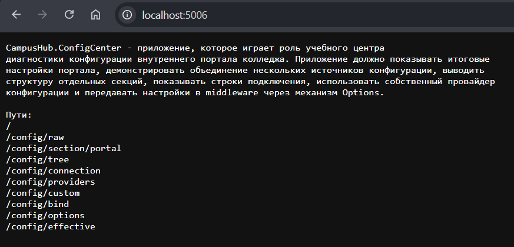

# CampusHub.ConfigCenter

## Фото всех обязательных маршрутов

1) `/`

2) `/config/raw`

3) `/config/section/portal`

4) `/config/tree`

5) `/config/connection`

6) `/config/providers`

7) `/config/custom`

8) `/config/bind`

9) `/config/options`

10) `/config/effective`

## Фрагмент Program.cs с порядком подключения источников конфигурации

## Фрагмент launchSettings.json с environmentVariables и commandLineArgs

## Скриншот ответа /config/effective и пояснение какой источник победил по каждому конфликтующему ключу

Скриншоты выше 
ПО ключам:
- Title: Development
- Semester: env
- SupportEmail: Development
- Admin: Name и Email: appsetting
- Sender: ini
- Signature: xml
- Channel: CLI

## Объяснение разницы между `Bind()/Get<T>()` и `IOptions<T>`

`Bind()/Get<T>()` - Чтение из IConfigurations (если нужна вложенность)

`IOptions<T>` - Получение из DI (Endpoint, сервисы или middleware)

## Краткое описание формата customsettings.txt и алгоритма работы собственного провайдера

В `customsettings.txt` файлы строки выглядят так

Работает так:

1. `builder.Configuration.AddTextFile("customsettings.txt");`
Подключаем данный метод через `TextConfigurationExtension` (добавляем источник в конфигурацию).
Этот класс определяет для объекта IConfigurationBuilder метод расширения AddTextFile(), в котором создается источник конфигурации TextConfigurationSource, который затем добавляется к строителю конфигурации.

2. `TextConfigurationSource`: возвращает объект `TextConfigurationProvider`, содержащий сам по себе объект, в метод Build() из данного файла в качестве параметра передается строитель конфигурации. В данном случае этот объект нам позволяет получить полный путь к текстовому файлу. Краткое название файла (относительный путь) передается в класс источника через конструктор и хранится в свойстве `_filename`. После создания полного пути к файлу этот путь передается в конструктор TextConfigurationProvider.

3. `TextConfigurationProvider`: получает путь файла и записывает из него пары в виде ключ:значение в свойство Data

## Скриншот или доказательство наличия заголовков X-Portal-Title и X-Portal-Semester в ответе

