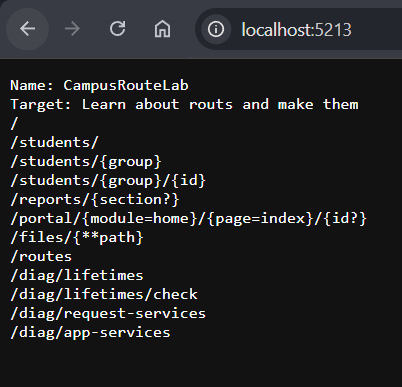
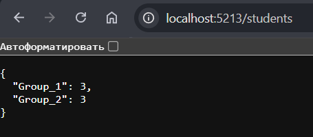
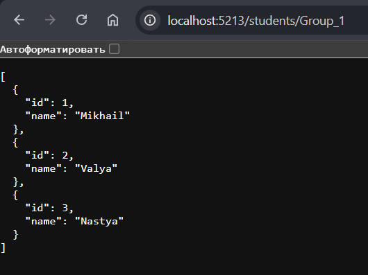
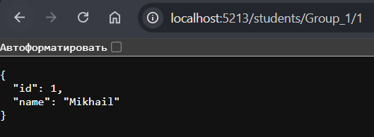
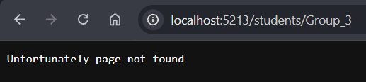
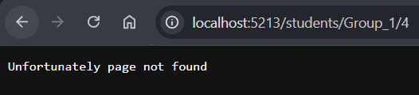
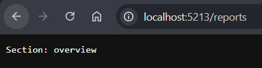

# Отчёт по работе CamousRouteLab

## Фотоотчёт о работе путей
1) `/`



2) Работа с путями `/students...`
Вот так выглядит сама по себе база студентов

```
private Dictionary<string, List<Student>> _listOfGrouos = new Dictionary<string, List<Student>> {
        ["Group_1"] = new List<Student> {
            new Student(1, "Mikhail"),
            new Student(2, "Valya"),
            new Student(3, "Nastya")
        },
        ["Group_2"] = new List<Student> {
            new Student(1, "Denis"),
            new Student(2, "Yulya"),
            new Student(3, "Max")
        }
    };
```

2.1. `/students`



2.2. `/students/Group_1`



2.3. `/students/Group_1/1`



2.4. Обработка несуществующих путей





3) `/reports/{section?}`




4) `/portal/{module=home}/{page=index}/{id?}`


5) `/files/{**path}`


6) `/routes`


7) Работа с путями `/diag...`

7.1. `/diag/lifetimes`


7.2. `/diag/lifetimes/check`


7.3. `/diag/request-services`


7.4. `/diag/app-services`


8) Неизвестные маршруты


## Middleware

### RequestAuditMiddleware

Насчёт данной конструкции
```
context.Response.OnStarting(() => {
    context.Response.Headers["X-App-Instance"] = _app.AppInstanceId.ToString();
    context.Response.Headers["X-Request-Id"] = request.RequestId.ToString();
    context.Response.Headers["X-Transient-Id"] = marker.Id.ToString();

    _logger.LogInformation("Only after _next(context)");

    return Task.CompletedTask;
});
```

Она регестрирует отложенное действие. После _next(context) заголовки уже заблокированы и их не установить, а по заданию требуется писать заголовки после _next(context)


## Разница между Transient, Scoped и Singelton

- Singelton - создаётся один раз при старте приложения и живёт, пока сервер не рванёт

- Scoped - создаётся 1 раз на 1 http запрос 

- Transient - создаётся новый при каждом запросе

## Почему scoped-сервис нельзя внедрять в конструктор middleware?

Потому что конструктор middleware создаётся и заполняется один раз при старте приложения.

## Таблица и жизненные циклы сервисов

| Сервис | Жизненный цикл |
|-|-|
| IStudentCatalogService / StudentCatalogService | Singelton |
| IAppInfoService / AppInfoService | Singelton |
| IRequestContextService / RequestContextService | Scoped |
| ITransientMarkerService / TransientMarkerService | Transient |
| DiagnosticsReportService | Transient |


