# HelpDesk

## Скриншот или список успешных запросов ко всем обязательным маршрутам

1) `/`

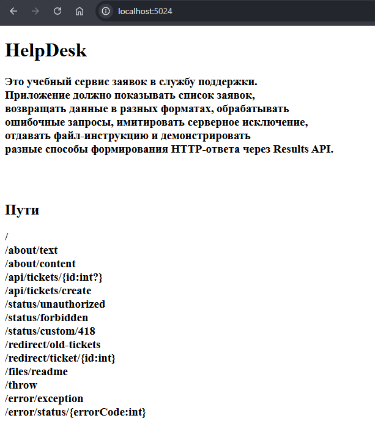

2) `/about/text`

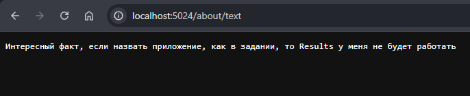

3) `/about/content`

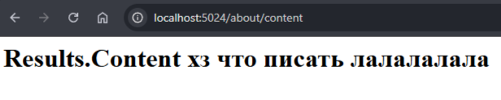

4) `/api/tickets`, `/api/tickets/1`, `/api/tickets/999`, `/api/tickets/create?title=Printer&priority=2`, `/api/tickets/create?priority=2`

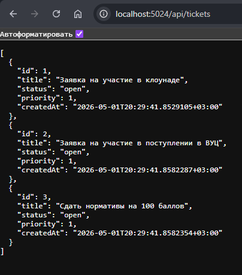

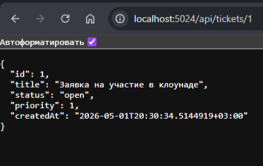

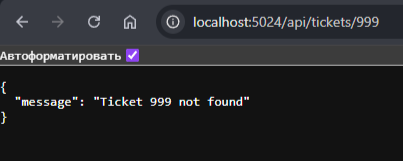

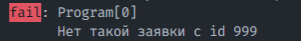

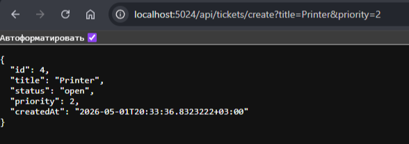

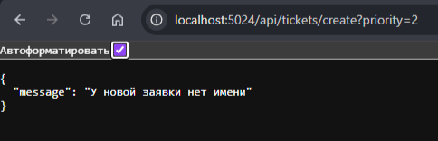

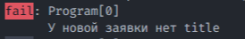

5) `/status/unauthorized`

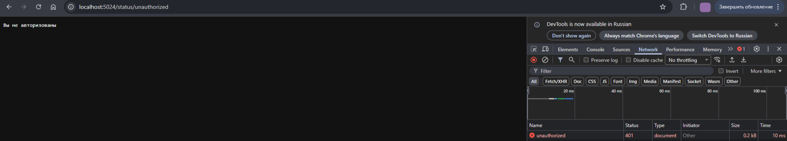

6) `/status/forbidden`

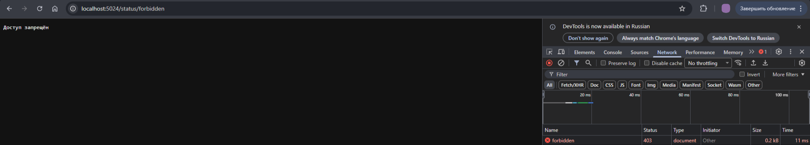

7) `/status/custom/418`

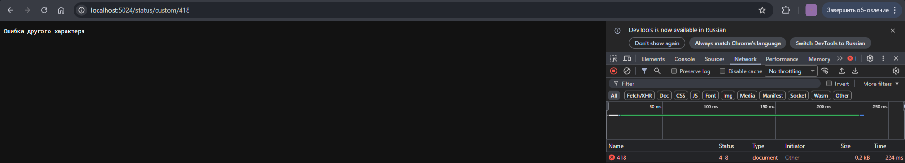

```
app.Map("/error/status/{errorCode:int}", (int errorCode, ILogger<Program> logger) => {
    string message = errorCode switch {
        400 => "Неверный запрос",
        401 => "Вы не авторизованы",
        403 => "Доступ запрещён",
        404 => "Извините, но данная страница не найдена",
        _ => "Ошибка другого характера"
    };

    logger.LogWarning($"Ошибка номер {errorCode} - {message}");
    return Results.Text(message);
});
```

8) `/redirect/old-tickets`

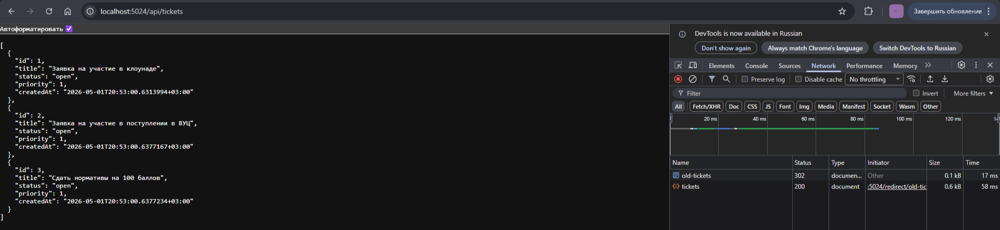

9) `/redirect/ticket/1`

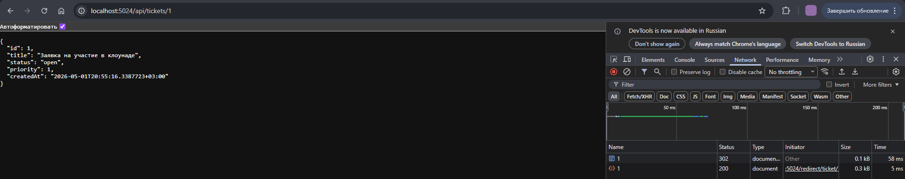

10) `/files/readme`

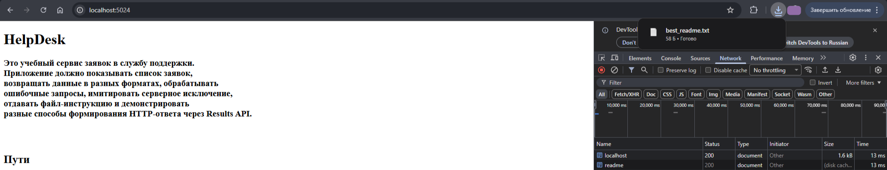

11) `/throw`

- Development

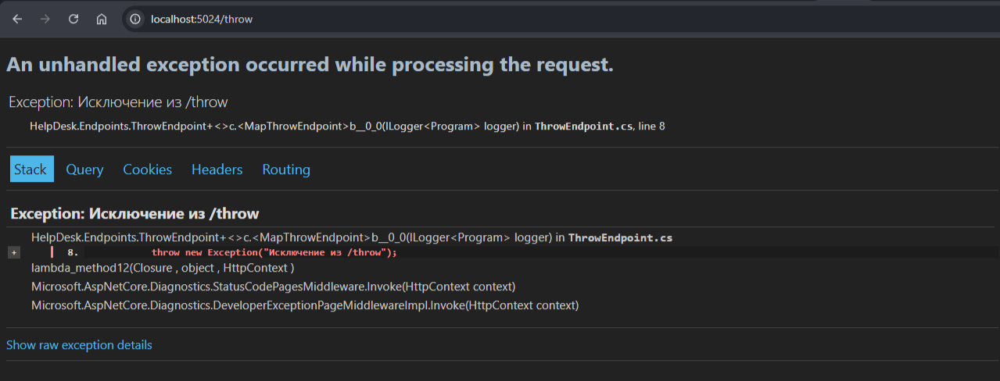

- Production

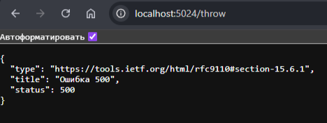

12) `/unknown`

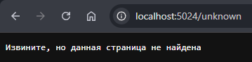

## Фрагмент Program.cs с порядком middleware и маршрутов

```
using HelpDesk.Extensions;
using HelpDesk.Services;


var builder = WebApplication.CreateBuilder(args);

builder.Services.AddTransient<ITicketRepository, InMemoryTicketRepository>();

var app = builder.Build();

// app.Environment.EnvironmentName = "Production";

if (app.Environment.IsDevelopment()) {
    app.UseDeveloperExceptionPage();
}
else {
    app.UseExceptionHandler("/error/exception");
}

app.UseStatusCodePagesWithReExecute("/error/status/{0}");

app.MapExtension();
app.Run();
```


## Объяснение, почему UseExceptionHandler и UseStatusCodePages должны находиться до конечных точек

Их ставят до конечных точек, тк конечные точки разворачивают конвейер обратно. Если поставить после них, то исключения просто не перехватятся.


## Краткое объяснение разницы между Results.Text, Results.Content, Results.Json и Results.File

- Results.Text - отправляет в ответ некоторое текстовое содержимое. Аналогичен методу Content(String, String, Encoding)
- Results.Content - отправляет в ответе некоторую строку. Позволяет вручную указать формат данных и кодировку
- Results.Json - отправляет ответ в формате JSON
- Results.File - отправляет в ответ файл


## Фрагмент собственного HtmlResult (у меня он называется RootHtml) и extension method

- RootHtml

```
namespace HelpDesk.Extensions;


public class RootHtml : IResult {
    private readonly string _code;

    public RootHtml(string code) {
        _code = code;
    }

    public async Task ExecuteAsync(HttpContext context) {
        context.Response.ContentType = "text/html; charset=utf-8";
        await context.Response.WriteAsync(_code);
    }
}
```

- Extension метод

```
namespace HelpDesk.Extensions;


public static class RootHtmlExtension {
    public static IResult GetListPathHtml(this IResultExtensions extension, string code) {
        return new RootHtml(code);
    }
}
```


## Вывод по работе: что было самым важным в понимании статуса ответа, тела ответа и Content-Type

Сымым важным было понять, что три этих компонента неразрывно связаны и работают вместе для правильной обработки браузером запроса


## Дополнительно

- Добавил логирование
- Добавил Results.Problem(). В отличие от Json() возвращает отчёт об ошибке в стандартной форме (нельзя задать свою)
- Добавил WithName()