# Отчёт о работе StudentPortal

## Фото работы

Фотография пути `/`

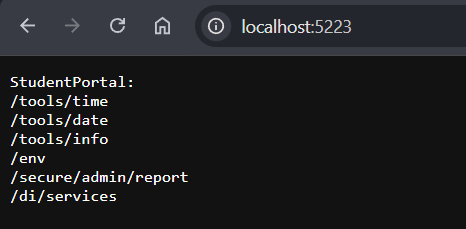

Фотография пути `/tools/time`

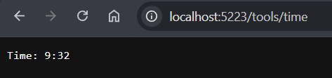

Фотография пути `/tools/time?trace=true`

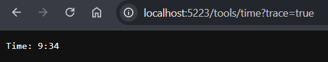
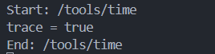

Фотография пути `/tools/date`

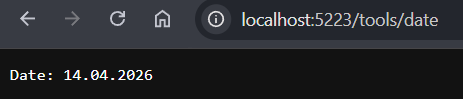

Фотография пути `/tools/info`

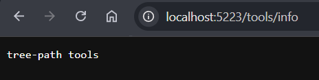

Фотография пути `/env`

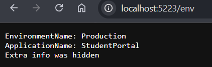

Фотография пути `/env?envName=Production`

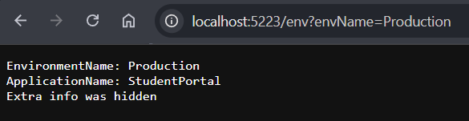

Фотография пути `/env?envName=Development`

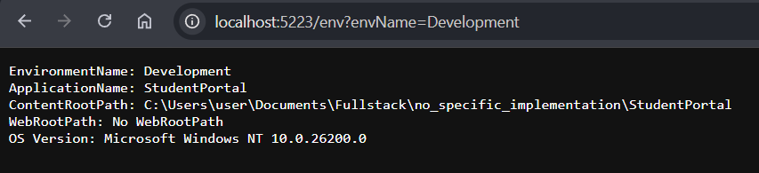

Фотография пути `/secure/admin/report`

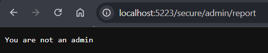

Фотография пути `/secure/admin/report?sudo=true`

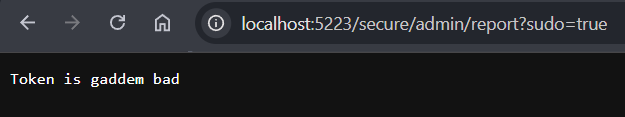

Фотография пути `/secure/admin/report?sudo=true&token=study2026`

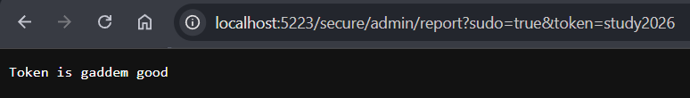

Фотография пути `/di/services`

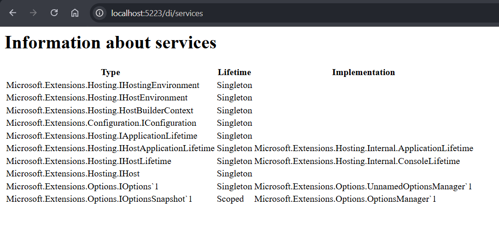

Фотография пути `/asdfghjkl`

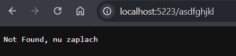

Логирование в процессе перехода по данным путям

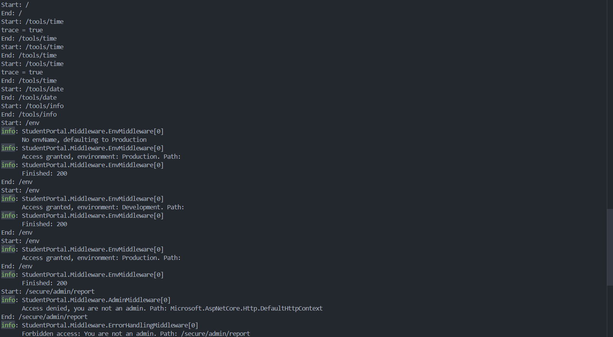
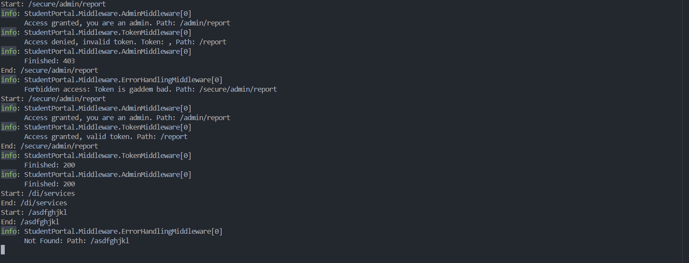

## Пояснения к доп-заданию
1) Таблица как будто и так ясно

2) В качестве защиты ветки /secure/admin был написан отдельный класс
AdminMiddleware.cs, в котором я получал значение ключа sudo доп данных Query.
Перед переходом в /admin проверяется значение ключа sudo аналогично проверке токена
перед переходом в /report. Аналогично для TokenExt... был написан файл AdminExt...

3) Сделал возможность разного вывода информации для Development и Production через обработку Query. 
Механизм схож с проверкой на админа. Для запроса сервиса пришлось изменить подход, запрашивая его через
context.RequestServices.GetRequiredService<IEnvironmentReportService>();.

4) Добавил логирование во все middleware